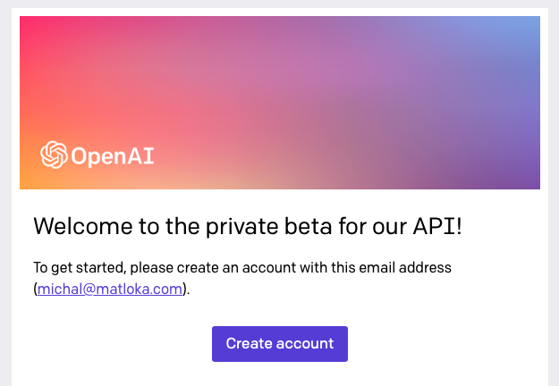

# Using GPT-3 in a Side Project - a Story

Then right after 2021 kicked off, I got a thought: hey, it'd be really interesting if my bot could chat more or less
_like a person_. That is, become a chatbot at last.
The obvious thought, and a trendy one for sure, was "GPT-3 FTW". The new OpenAI text-processing machine learning
model of 2020 made the rounds around the internet. It's proven itself to be imperfect… but still a _fantastic_ achievement (dangerously so even, maybe).
Only problem: it was (and still is almost a year after relase) in private beta. As a solo developer without
great cause, there's no fast track. You have to submit your request along with lots of other people and hope that eventually it gets accepted. I did that, though without much hope for quick access.
While waiting, maaaybe there was a more DIY way?

## Handmade

Well, I know some vague details of ML inner workings, but, like most software engineers, I don't have the domain knowledge and resources (time/money…) to implement a quality model from scratch – let alone a model capable of expressing something meaningful with natural language.
I turned to some libraries implementing a variety of ML approaches – Python excels in this space, and Hugging Face
was a useful resource. But for an actual chat bot resembling a human even approximately, and _particularly_ non-English
(this is Polish we're talking about), nothing was up to par. I mean, I could get some responses even, but nothing resembling a _chat_ at all. Not without training on a massive amount of relevant and varied data, that we carbon-based lifeforms take years to soak in.

No way for me to match GPT-3, even for all its imperfections. And I still have heard nothing from OpenAI.

So I abondoned the topic of a chatbot of my own, hoping for better times when this may be more feasible without massive resources.

## Welcome

A few months passed, I shipped pretty cool stuff at work (shout out to [PostHog](https://posthog.com)), added a few relatively "dumb" (but useful) features to the bot, watched its usage grow, started a new side project…

Then, I noticed a new email in my inbox:

A surprise to be sure, but a welcome one. After a 5 months' wait, GPT-3 was now only one account to create away. I did that and everything went smoothly. I was plopped into
